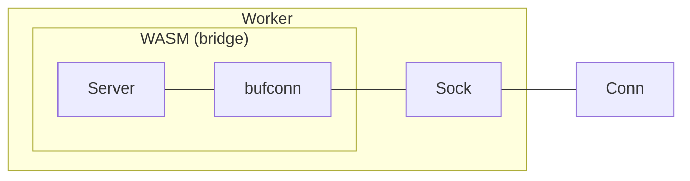

# grpc-wasm

> Currently, only the Go API is available.

Deploy your gRPC server as WebAssembly (WASM) and communicate with browser-side JavaScript.

**Why is this needed?** I was just tired of having to spin up a separate gRPC server every time I test the UI.

## Features

- [x] Unary call
- [x] Server streaming call
- [x] Client streaming call
- [x] Bi-directional streaming call
- [x] Support transport implementation for [timostamm/protobuf-ts](https://github.com/timostamm/protobuf-ts)

## Usage

### Server

```go
import (
	grpcwasm "github.com/lesomnus/grpc-wasm"
	"google.golang.org/grpc"
)

func main() {
	s := grpc.NewServer()
	// Register your gRPC service server implementation
	// e.g.
	//  echo.RegisterEchoServiceServer(s, echo.EchoServer{})

	grpcwasm.Serve(s)
}
```

Neat! I call this program a *bridge* because it exposes the socket to your gRPC server to the browser.

Assuming your *bridge* code is located at `./cmd/bridge`, build it into WASM:
```sh
GOOS=js GOARCH=wasm go build -o ./bridge.wasm ./cmd/bridge
```

### Client
```ts
import { open } from "grpc-wasm";

const sock = await open('path/to/your/bridge.wasm')
const conn = await sock.dial()

const msg: Echo = {
	message: "Royale with Cheese",
	withCircularShift: 6n
};
const req = Echo.toBinary(msg)
const rst = await conn.invoke("/echo.EchoService/Unary", req, {});
const res = Echo.fromBinary(rst.response);

console.log(res.message)
// "Cheese Royale with "

await conn.close()
await sock.close()
```

### with [timostamm/protobuf-ts](https://github.com/timostamm/protobuf-ts)

```ts
import { open } from "grpc-wasm";
import { GrpcWasmTransport } from "grpc-wasm/protobuf-ts";

const sock = await open('path/to/your/bridge.wasm')
const conn = await sock.dial()
const transport = new GrpcWasmTransport({ conn });

const client = new EchoServiceClient(transport);
const { response } = await client.Once({
	message: "Royale with Cheese",
	withCircularShift: 6n
})

console.log(response.message)
// "Cheese Royale with "
```

### with Vite

You have to add following option to your Vite config:

> ref: [vitejs/vite#15547](https://github.com/vitejs/vite/discussions/15547#discussioncomment-12890308)

```ts
definedConfig({
	// ...
	optimizeDeps: {
		exclude: ["grpc-wasm"],
	},
})
```

## Architecture


